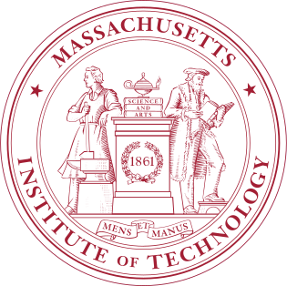
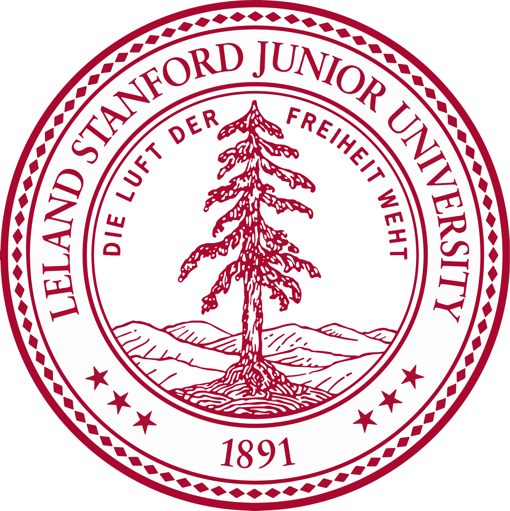
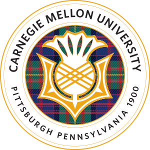

# Study Is Wonderful

跨学科好课，让好奇心自由生长。

[简体中文](README.md) · [English](README-en.md)

[153 门课程](#目录-contents) · [10 个学科](#目录-contents) · [60 篇技术文章](#技术博客-technical-blogs)

[推荐资源](https://github.com/xioacd99/study-is-wonderful/issues) · [参与共建](https://github.com/xioacd99/study-is-wonderful/pulls)

<!-- SOURCES:START -->

<strong>📚 资源来源 · 非赞助或背书</strong>

<!-- SOURCES:END -->

 
<a href="https://xioacd99.github.io/study-is-wonderful/resource-map/">🧭 打开学习星图 ↗</a>

## 数学

每个主题内按英文课程名称排序；不同课程版本不直接等同。

### 代数与矩阵方法

- [抽象代数](https://www.bilibili.com/BV1Ds41167HE)
  > 研究群、环等抽象结构，以及其中运算遵循的规则。

- [线性代数](https://www.bilibili.com/BV1zx411g7gq)
  > 学习用向量和矩阵解决线性方程，理解空间中的方向。

- [线性代数](https://www.bilibili.com/BV1fi4y1x7AH)
  > 探索向量、矩阵和线性变换怎样描述数据与空间。

- [矩阵论与应用](https://www.bilibili.com/BV17h411W7bk)
  > 用向量和矩阵整齐地表示数据与方程，并探索它们的应用。

- [MIT 18.065·数据分析、信号处理与机器学习中的矩阵方法（2018 春季）](https://ocw.mit.edu/courses/18-065-matrix-methods-in-data-analysis-signal-processing-and-machine-learning-spring-2018/) （MIT OpenCourseWare） · [官方第一讲](https://www.youtube.com/watch?v=YiqIkSHSmyc)（YouTube）
  > 跟随 Gilbert Strang 学习矩阵分解、概率统计与优化，理解线性代数如何支撑数据分析和深度学习。

### 数学思维与博弈

- [博弈论](https://www.bilibili.com/BV1Kt411h7Ep)
  > 研究当每个人的选择都会影响别人时，如何分析策略。

- [数学思维课](https://www.bilibili.com/BV1dq4y127TF)
  > 练习像数学家一样提问、推理，并用证明解释答案为什么成立。

### 优化与数值计算

- [最优化进阶与随机方法](https://www.bilibili.com/BV1J64y1F7nW)
  > 探索寻找最优解的方法，以及如何处理带有随机性的情况。

- [凸优化](https://www.bilibili.com/BV1Pg4y187Ed)
  > 认识利用凸性寻找最优解的方法，就像寻找碗底的最低点。

- [凸优化](https://www.bilibili.com/BV12x411z7ot)
  > 学习用凸优化在满足限制的选择中寻找最好结果。

- [数值分析](https://www.bilibili.com/BV1gv411j7rd)
  > 研究如何用计算机算出近似答案，并分析误差。

- [数值方法](https://www.bilibili.com/BV1sT4y1S7Aa)
  > 学习用数值计算近似解决难以直接求解的数学问题。

- [最优化方法](https://www.bilibili.com/BV19y4y1W7X1)
  > 探索怎样在各种可能选择中找到符合条件的最优解。

### 分析与微分方程

- [复分析](https://www.bilibili.com/BV1EJ41147q3)
  > 探索包含虚数的复数和复函数如何帮助解决数学问题。

- [微分方程](https://www.bilibili.com/BV1eM4y1g7De)
  > 用方程描述变化，例如物体的位置怎样随时间改变。

- [傅里叶分析](https://www.bilibili.com/BV1Qz4y167rb)
  > 用频率的视角研究函数与信号，就像把声音分解成音调。

- [傅里叶变换及其应用](https://www.bilibili.com/BV1Qx411J7ER)
  > 认识傅里叶变换如何把复杂信号拆成不同频率的成分。

### 几何与离散数学

- [离散微分几何](https://www.bilibili.com/BV1RQ4y1Z7HL)
  > 用离散的点和网格来研究曲线、曲面与几何形状。

- [离散数学](https://www.bilibili.com/BV1zh41167Uy)
  > 研究离散对象，例如逻辑命题、集合和由点线组成的图。

- [图论与可加组合学](https://www.bilibili.com/BV1Ei4y1x73V)
  > 研究点和连线组成的图，以及数字集合相加产生的组合规律。

- [黎曼几何](https://www.bilibili.com/BV19T4y1M7W5)
  > 研究弯曲空间中的距离与曲率，像理解地球表面的几何。

### 概率、统计与随机过程

- [应用统计](https://www.bilibili.com/BV14t411N7uw)
  > 学习从数据中估计、比较并作出有依据的判断。

- [离散随机过程](https://www.bilibili.com/BV1Qs41167VS)
  > 研究随机事件如何在一系列时刻或状态中演变。

- [概率论](https://www.bilibili.com/BV1kE41157pa)
  > 用概率描述不确定性，例如事情发生的可能性。

- [概率论](https://www.bilibili.com/BV19s41167TE)
  > 学习用概率和随机变量描述不确定的结果。

- [随机过程](https://www.bilibili.com/BV1qB4y1A7t3)
  > 研究随时间变化、结果带有不确定性的过程。

## 计算机科学

### 并行、分布式与性能

- [CMU·并行计算结构与编程](https://www.bilibili.com/BV16k4y1z7z9)
  > 探索怎样让多个处理单元一起工作，并编写利用它们的程序。

- [分布式系统](https://www.bilibili.com/BV1CU4y1P7PE)
  > 认识分布式系统，探索多台计算机如何协作完成任务。

- [MIT 6.172·软件系统性能工程（2018 秋季）](https://ocw.mit.edu/courses/6-172-performance-engineering-of-software-systems-fall-2018/) （MIT OpenCourseWare） · [官方第一讲](https://www.youtube.com/watch?v=o7h_sYMk_oc)（YouTube） · [转载](https://www.bilibili.com/video/BV1wA411h7N7/)（Bilibili）
  > 从矩阵乘法优化等实例出发，学习分析程序性能，理解算法、编程语言与计算机系统如何影响运行速度。

- [加州伯克利·并行计算应用](https://www.bilibili.com/BV1qV411q7RS)
  > 了解如何用并行计算更快地解决计算问题。

- [加州伯克利·并行程序设计导论](https://www.bilibili.com/BV1QQ4y1o7rn)
  > 学习将任务分给多个处理单元同时执行的编程思路。

### 编程基础与开发工具

- [CS101](https://web.stanford.edu/class/cs101/)
  > 认识计算机的硬件、软件和数据，并接触变量与循环等编程概念。

- [CS106B 编程抽象](https://web.stanford.edu/class/cs106b/)
  > 用编程抽象把复杂问题拆开，学习递归和数据结构等解决问题的工具。

- [CS50X 计算机入门](https://www.bilibili.com/BV1ER4y157uA)
  > 从零认识计算机科学与编程，学习如何把问题拆成计算机可以执行的步骤。

- [计算机科学与 Python 编程导论](https://ocw.mit.edu/courses/electrical-engineering-and-computer-science/6-0001-introduction-to-computer-science-and-programming-in-python-fall-2016/)
  > 用 Python 学习编程基础，练习用小程序解决问题。

- [MIT·python 编程](https://www.bilibili.com/BV1mq4y1u7NB)
  > 学习使用 Python 表达想法并编写程序。

- [MIT·计算机程序的构造与解释](https://www.bilibili.com/BV1AA411t7Wk)
  > 通过构造和理解程序，探索计算机科学的基本思想。

- [MIT·计算机教育中缺失的一课（2026）](https://www.youtube.com/playlist?list=PLyzOVJj3bHQunmnnTXrNbZnBaCA-ieK4L) · [中文配音转载](https://www.bilibili.com/video/BV1JgACzjEo8/)  · [课程官网](https://missing.csail.mit.edu/2026/) 
  > 学习 Shell、开发工具、调试、Git、代码发布与质量管理，并了解智能体编程如何融入日常开发。

- [编程方法学](https://www.bilibili.com/BV1zs411h7t8)
  > 学习编程的方法，练习把一个大问题拆成容易处理的小步骤。

- [斯坦福·C++ 中的抽象编程](https://www.bilibili.com/BV1G7411k7jG)
  > 学习用 C++ 的抽象工具组织和解决编程问题。

- [计算机教育中缺失的一课](https://www.bilibili.com/BV1x7411H7wa)
  > 认识程序员常用的工具，比如命令行、调试工具和版本管理。

### 算法、数据结构与理论

- [高级算法](https://www.bilibili.com/BV11E411u73m)
  > 学习高级算法，探索解决计算问题的进阶方法。

- [高级数据结构](https://www.bilibili.com/BV1iE411n7yJ)
  > 学习高级数据结构，也就是组织和使用数据的进阶方法。

- [经典算法](https://www.bilibili.com/BV1kf4y1w7Kn)
  > 认识经典算法，了解计算机解决问题时可以采用的步骤。

- [CS 61B](https://inst.eecs.berkeley.edu/~cs61b/sp20/index.html)
  > 学习数据结构，也就是让程序存放、查找和处理数据的方法。

- [CSE 373《算法设计手册》](https://www3.cs.stonybrook.edu/~skiena/373/videos/)
  > 学习分析算法，比较搜索、排序和图算法等方法需要多少时间与空间。

- [数据结构与算法设计](https://www.bilibili.com/BV1sf4y1H7vb)
  > 学习如何组织数据并设计算法，让程序有条理地解决问题。

- [理论计算机科学中的重要思想](https://www.bilibili.com/BV1Wh411y7V9)
  > 用数学的眼光认识计算机能解决什么问题，以及解决问题需要多少资源。

- [算法导论](https://www.bilibili.com/BV1fu41127MN)
  > 入门算法，学习如何设计解决问题的步骤并思考它们的效率。

### 计算机系统与操作系统

- [15-213](https://www.bilibili.com/video/BV1iW411d7hd) · [课程网页](http://www.cs.cmu.edu/~213/) 
  > 从程序员的角度认识计算机系统，了解机器代码、内存和网络等概念。

- [CS 107](http://web.stanford.edu/class/cs107/)
  > 走近计算机内部，学习 C 语言、内存和机器代码如何影响程序运行。

- [CS 61C](https://inst.eecs.berkeley.edu/~cs61c/fa20/)
  > 通过伯克利 CS 61C 课程学习计算机科学。

- [计算机系统介绍](https://www.bilibili.com/BV1uK4y1e7ep)
  > 认识计算机系统，探索软件和硬件如何协作运行程序。

- [MIT·计算结构](https://www.bilibili.com/BV197411s736)
  > 探索计算机如何由基本电路和构件组成。

- [操作系统与系统编程](https://www.bilibili.com/BV1ix411676b)
  > 认识操作系统如何为程序提供运行环境，并了解系统编程。

- [操作系统](https://www.bilibili.com/BV1QA411F7ij)
  > 学习操作系统的基本概念，认识管理计算机资源的软件。

- [操作系统](https://space.bilibili.com/202224425/channel/collectiondetail?sid=192498)
  > 学习操作系统的基本概念，认识管理计算机资源的软件。

### 网络、安全与密码学

- [CMU·计算机网络](https://www.bilibili.com/BV1wT4y1A7cd)
  > 了解计算机网络如何连接设备并传递信息。

- [计算机系统安全](https://www.bilibili.com/BV1jt411F7Wh)
  > 学习计算机系统安全，认识保护系统和信息的基本问题。

- [MIT·区块链与金钱](https://www.bilibili.com/BV1pK4y1r7Jf)
  > 探索区块链与货币、金融之间的关系。

- [普林斯顿·比特币与加密技术](https://www.bilibili.com/BV1FL411K7vK)
  > 了解比特币及其背后的密码学技术。

- [斯坦福·计算机网络](https://www.bilibili.com/BV137411Z7LR)
  > 探索数据如何通过网络在计算机之间传送。

- [斯坦福·密码学](https://www.bilibili.com/BV1Ht411w7Re)
  > 了解用数学方法保护信息的密码学。

- [斯坦福·网络安全](https://www.bilibili.com/BV1yA411s7Tp)
  > 了解保护网络和网络通信安全的基本问题。

### 数据科学与数据库

- [加州理工·数据驱动算法设计](https://www.bilibili.com/BV1ip4y1X7uY)
  > 探索如何利用数据帮助设计算法。

- [CMU·应用数据科学](https://www.bilibili.com/BV1Pa411F7VP)
  > 了解怎样用数据和计算方法解决实际问题。

- [CMU·数据库系统](https://www.bilibili.com/BV1rN411f7Ef)
  > 探索数据库系统如何组织、访问和管理数据。

- [CMU·数据库系统介绍](https://www.bilibili.com/BV1Cp4y1C7dv)
  > 了解数据库如何存储数据，以及怎样高效地查询它。

- [哈佛·大数据算法](https://www.bilibili.com/BV1v54y1x7dQ)
  > 探索处理大量数据时使用的算法。

- [斯坦福·CS 246](http://web.stanford.edu/class/cs246/)
  > 学习从海量数据中寻找有用模式的方法。

- [斯坦福·大数据概论](https://www.bilibili.com/BV1SC4y187x1)
  > 了解如何处理和挖掘大规模数据。

- [加州伯克利·数据库导论](https://www.bilibili.com/BV1yb4y1n7rb)
  > 了解数据库如何处理查询和同时发生的事务。

- [加州伯克利·数据科学原理与技术](https://www.bilibili.com/BV19741117jR)
  > 学习清理、分析和展示数据，并用数据建立预测。

### 软件工程与编译器

- [CMU·智能系统软件工程](https://www.bilibili.com/BV1qA411n7X5)
  > 探索如何为包含人工智能组件的系统设计和维护软件。

- [康奈尔·高级编译原理](https://www.bilibili.com/BV1hZ4y1L7X4)
  > 深入探索把程序转换成计算机可执行形式的编译技术。

- [康奈尔·软件工程](https://www.bilibili.com/BV1aW411E7yr)
  > 了解团队如何规划、设计、构建和测试软件。

- [斯坦福·编译原理](https://www.bilibili.com/BV1NW41177q4)
  > 了解编译器如何把一种程序语言转换成另一种形式；原链接目标待核实。 原目录中该链接被两个不同课程复用，目标待核实。

### 图形学与人机交互

- [CMU·计算机图形学](https://www.bilibili.com/BV1QZ4y1K7ga)
  > 探索计算机如何用数学和程序生成图像。

- [CMU·人机交互系列讲座](https://www.bilibili.com/BV1Bb411v7YH)
  > 探索人们如何与计算机系统互动。

- [闫令琪·现代计算机图形学入门](https://www.bilibili.com/BV1X7411F744)
  > 通过光栅化、光线追踪等方法，了解计算机如何生成图像。

- [MIT·计算机图形学](https://www.bilibili.com/BV167411g7iK)
  > 了解计算机图形学中生成和表示图像的基本思路。

### 信号与系统

- [MIT·信号与系统](https://www.bilibili.com/BV1L4411H7w3)
  > 了解如何描述和分析随时间变化的信号与系统。

- [奥本海姆·MIT·信号与系统](https://www.bilibili.com/BV1CZ4y1j7hs)
  > 了解信号如何经过系统发生变化，以及怎样用数学分析这些变化。

## 人工智能

### 强化学习与机器人

- [ETH Zurich·机器人学习：从基础到基础模型（2026）](https://cvg.ethz.ch/lectures/Robot-Learning/)· [第一讲](https://www.youtube.com/watch?v=X0k14u6pSxw)  · [B站转载](https://www.bilibili.com/video/BV1fSjG6LES5/) 
  > Oier Mees 从机器人控制、模仿学习和强化学习讲起，逐步介绍视觉语言动作模型与机器人基础模型，并结合仿真和真实机器人实践。

- [李宏毅·Deep Reinforcement Learning](https://www.youtube.com/watch?v=z95ZYgPgXOY&list=PLJV_el3uVTsODxQFgzMzPLa16h6B8kWM_)
  > 了解智能体如何通过尝试和反馈学习行动，并结合深度学习。

- [MIT·识别，估计和学习](https://www.bilibili.com/BV1KL4y1e7F7)
  > 探索如何根据观察识别、估计和学习系统的规律。

- [斯坦福 CS224R·深度强化学习](https://www.bilibili.com/video/BV1U2zYBqEFB/)（Bilibili 转载）
  > 了解智能体如何通过交互与奖励学习决策，以及深度学习如何用于强化学习。本转载的录制年份尚未核实。

- [斯坦福 CS224R·深度强化学习（2025 春季）](https://www.bilibili.com/video/BV15E2SB7EzE/) · [官方第一讲](https://www.youtube.com/watch?v=EvHRQhMX7_w) 
  > Chelsea Finn 介绍模仿学习、策略梯度、Actor-Critic、离线与基于模型的强化学习，并讨论这些方法在机器人和大语言模型中的应用。

- [斯坦福·强化学习](https://www.bilibili.com/BV1sb411s7eQ)
  > 了解智能体如何根据行动后的反馈改进决策。

- [斯坦福·机器人学](https://www.bilibili.com/BV16s411q7o7)
  > 了解让机器人感知环境并行动的机器人学。

- [加州伯克利·深度强化学习](https://www.bilibili.com/BV1fx411S7S8)
  > 探索结合神经网络与反馈学习的深度强化学习。

### 语言模型与自然语言处理

- [CMU·高级自然语言处理](https://www.bilibili.com/BV1H3411k7GA)
  > 深入探索计算机分析人类语言的方法。

- [CMU·自然语言处理](https://www.bilibili.com/BV1dC4y1h788)
  > 了解计算机如何处理和分析人类语言。

- [李宏毅·Deep Learning for Human Languange Processing](https://www.youtube.com/watch?v=nER51ZyJaCQ&list=PLJV_el3uVTsO07RpBYFsXg-bN5Lu0nhdG)
  > 探索用深度学习处理人类语言的方法。

- [斯坦福 CS336：从零构建语言模型（第一讲）](https://www.youtube.com/watch?v=SQ3fZ1sAqXI) · [2025 春季课程官网](https://cs336.stanford.edu/spring2025/)
  > 从第一讲认识语言模型与分词，开启对大模型构建方法的学习。 官方课程网站提供完整课表和五项作业，覆盖基础实现、系统优化、规模规律、数据处理及对齐与推理强化学习。

- [斯坦福·深度自然语言处理](https://www.bilibili.com/BV1pt411h7aT)
  > 了解如何用神经网络帮助计算机处理语言。

- [浙江大学大模型原理与技术](https://www.bilibili.com/video/BV1PB6XYFET2/)
  > 从语言模型基础出发，学习大模型架构、微调与检索增强生成等内容。

### 机器学习与人工智能基础

- [伯克利·CS 188](https://inst.eecs.berkeley.edu//~cs188/fa19/)
  > 通过搜索、推理和学习等方法，认识人工智能的基础。

- [伯克利·CS 189](https://www.eecs189.org/)
  > 了解如何用数据训练模型，以及怎样判断模型的表现。

- [CMU·人工智能 (研究生)](https://www.bilibili.com/BV1pC4y1t7px)
  > 了解让计算机表现出智能的基本思路。

- [李宏毅·机器学习-v1](https://www.youtube.com/watch?v=CXgbekl66jc&list=PLJV_el3uVTsPy9oCRY30oBPNLCo89yu49)
  > 学习让计算机从数据中发现规律的机器学习方法。

- [李宏毅·机器学习-v1](https://www.youtube.com/watch?v=7XZR0-4uS5s&list=PLJV_el3uVTsPM2mM-OQzJXziCGJa8nJL8)
  > 学习让计算机从数据中发现规律的机器学习方法。

- [李宏毅·机器学习-v2](https://www.youtube.com/watch?v=Ye018rCVvOo&list=PLJV_el3uVTsMhtt7_Y6sgTHGHp1Vb2P2J)
  > 学习让计算机从数据中发现规律的机器学习方法。

- [李宏毅·机器学习-TA 补充课](https://www.youtube.com/watch?v=eybCCtNKwzA&list=PLJV_el3uVTsM8QoIIe9JrSDjB0e1UkbEC)
  > 学习让计算机从数据中发现规律的机器学习方法。

- [MIT·机器学习](https://www.bilibili.com/BV1a7411M7wH)
  > 了解计算机如何从数据中学习，并用学到的规律作预测。

- [斯坦福·人工智能原理与技术](https://www.bilibili.com/BV1Ht4y1U75j)
  > 了解设计能搜索、推理和学习的人工智能系统的基本思路。

### 深度学习与生成模型

- [李宏毅·Advanced Topics in Deep Learning](https://www.youtube.com/watch?v=IzHoNwlCGnE&list=PLJV_el3uVTsPMxPbjeX7PicgWbY7F8wW9)
  > 探索深度学习中更深入的研究主题。

- [李宏毅·Deep Learning Theory](https://www.youtube.com/watch?v=KKT2VkTdFyc&list=RDLVKKT2VkTdFyc&start_radio=1&rv=KKT2VkTdFyc&t=5)
  > 从理论角度理解深度神经网络为什么可能有效。

- [李宏毅·GAN-2017](https://www.youtube.com/watch?v=G0dZc-8yIjE&list=PLJV_el3uVTsMd2G9ZjcpJn1YfnM9wVOBf)
  > 认识生成对抗网络：两个模型相互较量，帮助生成新数据。

- [李宏毅·GAN-2018](https://www.youtube.com/watch?v=DQNNMiAP5lw&list=PLJV_el3uVTsMq6JEFPW35BCiOQTsoqwNw)
  > 认识生成对抗网络：两个模型相互较量，帮助生成新数据。

- [李宏毅·Next Step of Machine Learning](https://www.youtube.com/watch?v=XnyM3-xtxHs&list=PLJV_el3uVTsOK_ZK5L0Iv_EQoL1JefRL4)
  > 思考机器学习可以向哪些方向继续发展。

- [MIT·深度学习](https://www.bilibili.com/BV1qt411c7Na)
  > 了解使用多层神经网络从数据中学习的深度学习。

### 统计、结构化学习与应用

- [加州理工·机器学习与统计推断基础](https://www.bilibili.com/BV1uA411n7oV)
  > 探索机器学习与统计推断的基础：如何从数据中学习和判断。

- [CMU·结构化数据机器学习](https://www.bilibili.com/BV1MK4y1a7PS)
  > 探索如何让机器学习处理具有内部关系或结构的数据。

- [李宏毅·Structured Learning](https://www.youtube.com/watch?v=5OYu0vxXEv8&list=PLJV_el3uVTsNHQKxv49vpq7NSn-zim18V)
  > 了解如何让模型学习彼此有关联的输出。

- [MIT·医疗机器学习](https://www.bilibili.com/BV1oa411c7eD)
  > 探索机器学习如何帮助分析医疗相关数据。

- [斯坦福·图机器学习](https://www.bilibili.com/BV1Vg4y1z7Nf)
  > 探索如何用机器学习分析由节点和连接组成的图。

- [斯坦福·统计学习](https://www.bilibili.com/BV1NW41177q4)
  > 学习利用统计方法从数据中建立模型和做预测。 原目录中该链接被两个不同课程复用，目标待核实。

- [加州伯克利·统计机器学习](https://www.bilibili.com/BV1KA41157yn)
  > 从统计角度理解机器如何从数据中学习。

## 经济学

### 金融市场与理论

- [金融市场](https://www.bilibili.com/BV1ab411b7jq)
  > 认识金融市场如何连接投资、融资和风险。

- [金融理论](https://www.bilibili.com/BV1Ft4112796)
  > 学习用金融理论理解资产价值、投资和风险。

### 微观与行为经济学

- [行为经济学](https://www.bilibili.com/BV11U4y1g78u)
  > 探索心理因素怎样影响人们的经济选择。

- [微观经济学](https://www.bilibili.com/BV1MV411U75D)
  > 研究个人和企业如何作选择，以及价格怎样受供需影响。

## 物理学

### 天体物理与基本理论

- [广义相对论](https://www.bilibili.com/BV1tE411R75K)
  > 认识广义相对论如何用弯曲的时空解释引力。

- [弦理论和 M 理论](https://www.bilibili.com/BV1CE411Q7Cc)
  > 探索用弦和更广泛的 M 理论描述基本物理的想法。

- [耶鲁 ASTR 160·天体物理学的前沿与争议（2007 春季）](https://oyc.yale.edu/astronomy/astr-160)（Open Yale Courses） · [官方第一讲](https://www.youtube.com/watch?v=nzmFc2gjUo4)（YouTube） · [课程视频](https://www.bilibili.com/video/BV1kroeBrEer/)（Bilibili）
  > 跟随 Charles Bailyn 探索系外行星、黑洞和暗能量，学习如何用观测证据分析尚无定论的科学问题。

### 力学与量子物理

- [MIT 8.01SC·经典力学（2016 秋季）](https://ocw.mit.edu/courses/8-01sc-classical-mechanics-fall-2016/) （MIT OpenCourseWare） · [第一周导论](https://www.youtube.com/watch?v=i4u7SZjoAs4)（YouTube） · [课程视频](https://www.bilibili.com/video/BV1KQ4y1B7TJ/)（Bilibili）
  > 从运动与受力出发，学习牛顿定律、动量、能量和旋转，练习用数学描述并解决经典力学问题。

- [量子力学](https://www.bilibili.com/BV1w4411s7da)
  > 探索量子力学如何描述原子等微观世界。

## 心理学

### 心理学基础与研究方法

- [心理学导论](https://www.bilibili.com/BV1Ps411Z7h1)
  > 认识心理学如何研究思考、情绪和行为。

- [心理学导论](https://www.bilibili.com/BV1hZ4y1w7kd)
  > 了解心理学如何研究人的思想、感受和行为。

- [心理统计学](https://www.bilibili.com/BV1UJ411c7d8)
  > 学习用统计方法分析心理学研究收集的数据。

- [社会认知心理学](https://www.bilibili.com/BV1Hx411u7SK)
  > 探索我们如何理解别人，以及社会环境如何影响思考。

### 积极心理与幸福

- [幸福课](https://www.bilibili.com/BV1px411d7xr)
  > 探索幸福和生活满意度可以怎样被理解与研究。

- [积极心理学](https://www.bilibili.com/BV1ga41127Zt)
  > 探索心理学怎样研究优势、幸福感和积极关系。

## 社会科学

### 历史、社会与政治

- [资本主义](https://www.bilibili.com/BV1x5411g7R5)
  > 探索资本主义中企业、市场与社会之间的关系。

- [现代社会理论基础](https://www.bilibili.com/BV1ux411r736)
  > 认识社会思想家怎样解释社会、制度和人与人的关系。

- [政治哲学导论](https://www.bilibili.com/BV1wx411y7uW)
  > 通过思想家的问题，思考政府、自由与公正。

- [耶鲁 HIST 119·美国南北战争与重建，1845–1877（2008 春季）](https://oyc.yale.edu/history/hist-119)（Open Yale Courses） · [官方第一讲](https://www.youtube.com/watch?v=QXXp1bHd6gI)（YouTube） · [课程视频](https://www.bilibili.com/video/BV1Ws411q7Lv/)（Bilibili）
  > 跟随 David W. Blight 了解美国南北战争的起因与影响，探讨奴隶制、解放和战后重建如何改变美国社会。

## 生物学

### 分子与细胞生物学

- [MIT 7.016·生物学导论（2018 秋季）](https://ocw.mit.edu/courses/7-016-introductory-biology-fall-2018/)  · [官方视频目录](https://ocw.mit.edu/courses/7-016-introductory-biology-fall-2018/video_galleries/lecture-videos/) 
  > 从生物化学、遗传学和细胞生物学入门，理解基因、蛋白质与细胞如何协同工作，并认识这些原理在健康与疾病研究中的应用。

### 行为生物学

- [人类行为生物学](https://www.bilibili.com/BV1FF411Y72Y)
  > 探索大脑、身体和环境怎样共同影响人类行为。

## 哲学与艺术

### 形而上学与生命哲学

- [耶鲁 PHIL 176·死亡（2007 春季）](https://oyc.yale.edu/death/phil-176)（Open Yale Courses）
  > 从人格同一性、心灵与身体等问题出发，讨论死亡、永生与生命价值，学习比较论证并检视自己的哲学立场。

### 诗歌与美学

- [美学](https://www.bilibili.com/BV1av411e778)
  > 思考什么是美，以及我们为什么会对艺术产生不同感受。

- [耶鲁 ENGL 310·现代诗歌（2007 春季）](https://oyc.yale.edu/english/engl-310)（Open Yale Courses） · [官方第一讲](https://www.youtube.com/watch?v=aG9el6hOjm8)（YouTube）
  > 跟随 Langdon Hammer 细读现代英语诗歌，认识 Frost、Yeats、Eliot 等诗人，并从历史与文学批评角度理解作品。

### 建筑与城市历史

- [耶鲁 HSAR 252·罗马建筑（2009 春季）](https://oyc.yale.edu/history-of-art/hsar-252)（Open Yale Courses） · [课程视频](https://www.bilibili.com/video/BV1ht411s7zq/)
  > 跟随 Diana E. E. Kleiner 认识罗马及其帝国的建筑、城市规划与装饰，学习从神庙、浴场、剧场和住宅理解古代城市生活。

## 其他

### 跨学科方法与科研写作

- [几何折叠算法](https://www.bilibili.com/BV14q4y1R7Ra)
  > 用算法研究纸张、连杆和多面体怎样折叠。

- [SCI 论文写作课程](https://www.bilibili.com/BV1zv41177JQ)
  > 学习怎样更清楚地写作和表达科学研究。

### 创业、沟通与个人发展

- [如何创业](https://www.bilibili.com/BV1KK4y1s7mY)
  > 探索如何把一个点子发展成创业项目。

- [谈判概论](https://www.bilibili.com/BV13T4y1L7AT)
  > 学习分析谈判中各方的目标，并寻找双方都能接受的结果。

- [如何管理情绪](https://www.bilibili.com/BV1KK4y1P7Df)
  > 探索识别情绪和应对压力的方法。

### 文学、音乐与人文

- [文学理论导论](https://www.bilibili.com/BV15s411x7LU)
  > 探索文学理论如何帮助我们提出问题并理解作品。

- [聆听音乐](https://www.bilibili.com/BV1sW411a7nM)
  > 学习更仔细地聆听音乐中的节奏、旋律与结构。

- [罗翔讲刑法](https://www.bilibili.com/BV1dj411f7vb)
  > 通过罗翔的讲解认识刑法及其基本问题。

- [欧丽娟说红楼梦](https://www.bilibili.com/BV1hp4y1t7zq)
  > 跟随欧丽娟解读《红楼梦》中的人物和文化。

## 技术博客

### 智能体与 AI 编程

- [科研加速：智能体擅长什么、又卡在哪里](https://openai.com/index/research-acceleration-jagged-frontier/) 
  > 通过内部任务和使用数据，比较智能体在监控训练、启动实验和编写推理代码上的表现，了解不同环节为什么提速不一。

- [用 AI 智能体把改进迁移到不同广告排序模型](https://engineering.fb.com/2026/11/18/ml-applications/ai-agents-to-scale-ml-innovations-across-ads-ranking-models/) 
  > 了解 Meta 如何把一种排序模型中验证过的改进适配到其他模型，再通过标准化实验筛选值得继续训练的方案。

- [为 OpenClaw 等常驻智能体建立安全边界](https://developers.openai.com/blog/securing-persistent-agents-like-openclaw-at-openai) 
  > 了解如何把可信控制服务与智能体执行环境分离，并结合沙箱、凭据代理和操作审核，为长期运行的智能体建立安全边界。

- [Claude Code 自动模式：更安全地减少权限确认](https://www.anthropic.com/research/claude-code-auto-mode) 
  > 了解工具输出中的提示注入检查与操作审批分类器如何协作，在减少人工确认的同时识别偏离用户意图的高风险动作。

- [Orchestrator：在规划与执行之间动态切换模型](https://antigravity.google/blog/gemini-4-hydrogen-in-google-antigravity) Google Antigravity Blog 
  > 了解同一编程任务如何由不同模型负责规划和执行，并在遇到困难时重新分工，以平衡质量、延迟与成本。

- [Gemini 4 Hydrogen：面向智能体工作流的执行模型](https://blog.google/innovation-and-ai/models-and-research/gemini-models/introducing-gemini-4-hydrogen/) Google Blog 
  > 认识面向代码修改、测试与工具调用的模型设计取向，了解思考强度和多模型协作如何影响执行效率。

- [智能体编程时代的代码审查](https://www.clay.com/blog/code-reviews-agents) Clay Engineering 
  > 看 Clay 如何把人工审查重点转向需求、架构边界、安全与验证证据，而不是只逐行寻找代码错误。

- [共享资源时，多智能体为何可能表现更差](https://alignment.anthropic.com/2026/worse-together/) Anthropic Alignment Science 
  > 通过共享预算、排班和订餐等模拟任务，了解多个智能体为何会协调失败，以及明确负责人和提交前读取消息如何帮助改进。

- [lemonflow：电动车充电场景中的实时智能体](https://cloud.google.com/blog/topics/startups/building-real-time-agents-for-ev-charging-using-gemma-and-tpus) Google Cloud Blog 
  > 通过充电客服案例，认识实时语音服务的延迟要求，以及如何用统一后端接口和任务优先级调度支持智能体。

- [AlphaProof Code：用形式化证明验证软件](https://deepmind.google/blog/introducing-alphaproof-code/) Google DeepMind 
  > 了解人类如何确定安全规格，再由智能体生成 Lean 证明、交给独立检查器验证，以减少复杂软件中的验证工作。

- [Project EVE：让 Claude 玩大型多人在线游戏](https://www.anthropic.com/research/project-eve-claude-plays-mmorpgs) 
  > 通过模拟交易与实时游戏任务，了解智能体如何规划、协作，以及团队在长期任务和蓄意干扰下的局限。

- [智能体记忆的组成](https://www.anthropic.com/research/components-of-agent-memory) 
  > 了解如何将执行记录整理成可复用的记忆，并通过回顾旧记录纠错，帮助智能体跨会话积累经验。

- [Codex 编排的开源规范 Symphony](https://openai.com/index/open-source-codex-orchestration-symphony/) 
  > 了解如何以任务看板协调编码智能体的工作区、执行与人工审查。

- [用并行 Claude 团队构建 C 编译器](https://www.anthropic.com/research/building-c-compiler) 
  > 通过构建编译器的实验，了解多个智能体协作、测试与长期运行的经验和限制。

- [轻量编排器：让路由器少做一点](https://engineering.fb.com/2026/10/19/ml-applications/thin-orchestrator-ai-agent-architecture/) 
  > 了解如何把流程调度与专业推理分开，让编排器负责顺序和检查，专门的智能体处理具体任务。

- [CodeMender：用 AI 协助修复代码漏洞](https://deepmind.google/blog/introducing-codemender-an-ai-agent-for-code-security/) 
  > 了解智能体如何定位漏洞根因、生成补丁并用程序分析和测试检查改动，以及人工审查在发布前的作用。

### AI 评测

- [从训练到部署：如何管理前沿 AI 风险](https://openai.com/index/managing-frontier-ai-risk/) 
  > 了解如何在研究、内部使用和公开发布阶段搭配沙箱、行为监控与安全评审，以及这些阶段各自要解决什么风险。

- [AgentReplay：用真实失败轨迹做回归评测](https://deploymentsafety.openai.com/gpt-6-2-astra-sol/agentreplay) 
  > 了解如何从历史任务的关键决策点重新运行智能体，判断新版本是否重蹈覆辙，以及为何这类结果不能代表实际事故率。

- [医疗工作流中的计算机操作智能体评测](https://openai.com/index/advancing-computer-use-for-healthcare-teams/) 
  > 通过跨医疗软件的操作案例，了解如何分别评价智能体的有用性、安全性和成本，并在关键步骤保留人工审核。

- [稀释有毒微调数据为何反而可能增强其影响](https://alignment.anthropic.com/2026/homeopathic-learning/) 
  > 通过受控微调实验，了解为什么加入干净数据有时会强化隐藏触发行为，以及仅单独审核各数据源的局限。

- [自动研究智能体能否缓解已知的对齐失败](https://alignment.anthropic.com/2026/automated-alignment-researchers/) 
  > 了解自动研究智能体如何提出后训练方法，并通过留出测试、行为审计和跨模型验证，检查对齐改进是否具有泛化能力。

- [AI 组织可能更高效，却比单个智能体更难对齐](https://alignment.anthropic.com/2026/ai-organizations/) 
  > 通过模拟咨询与软件团队，考察多智能体协作中的业务目标与伦理约束冲突，以及局部分工如何影响整体行为。

- [可靠安全评测的设计方法](https://www.anthropic.com/research/building-strong-safety-evaluations) Anthropic 
  > 学习如何明确要测量的模型行为、设计测试场景与评分方法，并用可复现的设置和不确定性分析解释结果。

- [XYBench：识别提问背后的真实目标](https://allenai.org/blog/xybench) Ai2 
  > 了解如何评测模型能否发现用户提出的方法存在误区，并帮助用户解决真正想解决的问题，而不只是照着错误前提回答。

- [训练过程如何影响思维链可监控性](https://alignment.openai.com/cot-monitorability-model-lifecycle/) OpenAI Alignment Research 
  > 了解预训练、强化学习和模型生成数据如何改变推理能力与思维链可控性，以及为什么可见推理文本不能完整代表模型行为。

- [双盲 AI 评测试点](https://deepmind.google/blog/piloting-the-worlds-first-double-blind-ai-evaluations/) 
  > 了解机密计算如何让评测方保留测试题、模型提供方保留权重，同时在隔离环境中运行评测，减少信息泄漏。

- [奖励作弊如何影响模型行为](https://alignment.anthropic.com/2026/reward-seeker/) 
  > 通过刻意设置奖励漏洞的受控训练实验，了解模型如何学会钻评分规则的空子，以及这种行为可能如何迁移。

- [智能体在评测与实际使用中的行为差距](https://alignment.openai.com/eval-production-behavior-gap/) 
  > 了解安全测试与实际使用中的表现为何可能不同，以及模型对测试目标的猜测如何影响评测结果。

- [LifeVal：评估 AI 完成日常任务的能力](https://openai.com/index/lifeval/) 
  > 认识围绕日常实际需求构建的评测，关注 AI 能否帮助人们完成任务。

- [设计能应对 AI 能力进步的技术评测](https://www.anthropic.com/research/AI-resistant-technical-evaluations) 
  > 通过性能工程招聘测试的多轮改版，思考怎样在 AI 能力提升时继续评估人的问题分析与工具构建能力。

- [用强化学习训练对齐审计员](https://alignment.anthropic.com/2026/training-alignment-auditors/) 
  > 认识如何训练模型调查另一个模型的隐藏行为，并了解奖励设计与正常样本如何影响审计质量和误报。

- [用自我评估扩展滥用检测](https://safeguards.anthropic.com/2026/self-assessment/) 
  > 了解模型如何在回复后复用对话计算来初步检查潜在滥用，以及为什么这类检查仍需与其他安全措施配合。

- [自动化研究隐蔽的涌现式失配](https://alignment.anthropic.com/2026/automated-em-search/) 
  > 通过受控红队实验，了解看似无害的微调数据为何可能改变模型行为，以及如何用自动化测试发现训练数据监控的盲区。

### 工程基础设施

- [稀疏注意力：长上下文推理的模型与 GPU 协同设计](https://developer.nvidia.com/blog/co-designing-sparse-attention-for-efficient-long-context-inference/) 
  > 了解稀疏注意力如何把部分开销转移到索引和候选筛选，以及 GPU 访存如何影响逐词元与分块方案的性能。

- [MLPerf Endpoints：衡量多轮智能体的推理性能](https://developer.nvidia.com/blog/nvidia-vera-rubin-nvl72-leads-agentic-inference-performance-on-mlperf-endpoints-v1-0/) NVIDIA Technical Blog 
  > 了解如何一起比较多轮智能体的响应速度、吞吐与功耗，以及前缀缓存和状态复用的作用；文中的部分硬件结果仍待基准组织最终核验。

- [MLPerf Training：比较预训练与强化学习系统性能](https://developer.nvidia.com/blog/nvidia-vera-rubin-nvl72-achieves-up-to-2x-blackwell-ultra-performance-in-mlperf-training-v6-1/) NVIDIA Technical Blog 
  > 认识固定模型、设备数量与训练目标的性能比较方法，了解大规模通信和扩展效率如何影响预训练与 GRPO 工作负载。

- [Tunix：让强化学习训练与推理逐位一致](https://developers.googleblog.com/en/unlocking-stable-on-policy-rl-on-tpu-with-bitwise-zero-traininference-mismatch/) Google Developers Blog 
  > 了解浮点累加顺序为何会让同一模型算出不同概率，以及如何对齐解码、预填充和训练路径，检查强化学习中的数值一致性。

- [vLLM 编码器分离：用 EPD 扩展多模态推理服务](https://vllm.ai/blog/2026-11-11-encoder-disaggregation-epd) vLLM Blog
  > 了解如何拆分多模态编码、预填充和解码阶段，通过远程嵌入传输与缓存复用，独立调整各阶段的计算资源。

- [零数值偏差的异步强化学习：REINFORCE Zero](https://vllm.ai/blog/2026-11-06-zero-mismatch-async-rl) vLLM Blog
  > 区分异步强化学习中的权重滞后与计算内核数值偏差，理解对齐推理和训练计算后，重要性采样如何修正旧策略生成的样本。

- [BigQuery 与 Looker 的智能体可观测性](https://cloud.google.com/blog/products/data-analytics/enterprise-ai-agent-observability-with-bigquery-and-looker/) Google Cloud Blog 
  > 了解如何汇集智能体的运行记录，分析执行步骤、成本和质量，并在监控过程中保护敏感数据。

- [用 vLLM 跨两台 DGX Station 部署 GLM-5.3](https://developer.nvidia.com/blog/when-one-gpu-isnt-enough-serving-glm-5-3-across-two-nvidia-dgx-stations-with-vllm/) NVIDIA Technical Blog 
  > 学习如何通过张量并行与 RDMA 将大模型分布到两台机器上，提供统一推理入口，并测量并发请求下的吞吐和延迟。

- [llama.cpp 1.0：构建稳定的本地 AI 基础](https://huggingface.co/blog/ggml-org/llama-cpp-v1) ggml-org / Hugging Face 
  > 了解 API 与 ABI 版本边界、软件打包和跨硬件测试如何帮助应用更稳定地集成本地模型推理。

- [Intelligent Delivery：按收益分配推理算力](https://engineering.fb.com/2026/11/11/ml-applications/intelligent-delivery-serve-better-ads/) Engineering at Meta 
  > 学习如何预测不同请求增加算力后的收益，并在延迟约束下协调数据中心、硬件和模型的资源分配。

- [AlloyDB AI：在 SQL 中分类文本与提取结构化数据](https://cloud.google.com/blog/products/databases/ai-classify-and-ai-extract-functions-in-alloydb-ai) Google Cloud Blog 
  > 了解如何用 SQL 调用模型完成文本分类和 JSON 提取，以及批量处理如何减少逐行推理的开销。

- [Cloud Pathways：统一调度大规模机器学习任务](https://cloud.google.com/blog/topics/ai-infrastructure/cloud-pathways-a-distributed-ml-runtime-is-ga) Google Cloud Blog 
  > 了解单个 JAX 控制器如何协调多个 TPU 分区，以及资源故障后重新分片、继续训练的设计。

- [NVIDIA Snapshot：复用已初始化的 GPU 工作负载](https://developer.nvidia.com/blog/start-and-restore-gpu-workloads-in-seconds-with-nvidia-snapshot/) NVIDIA Technical Blog 
  > 了解如何保存 CPU 与 GPU 的运行状态，在兼容硬件上恢复推理服务，避免重复加载权重、编译和捕获计算图。

- [TPU Sync：加快推理缓存与训练权重传输](https://cloud.google.com/blog/topics/ai-infrastructure/introducing-tpu-sync-fast-kv-cache-and-weight-transfer-on-tpu) Google Cloud Blog 
  > 了解如何在 TPU、主机内存与存储之间异步搬运模型状态，支持推理缓存复用，以及仍处于实验阶段的强化学习权重同步。

- [Agent Substrate：在 Kubernetes 上运行大规模智能体](https://developer.nvidia.com/blog/agent-substrate-advancing-kubernetes-for-agents-at-scale/) NVIDIA Technical Blog 
  > 学习如何让多个智能体会话复用预热工作节点，并保存和恢复空闲会话的状态，减少环境等待与资源闲置。

- [用 Reshard 加速强化学习权重同步](https://developer.nvidia.com/blog/accelerating-reinforcement-learning-weight-refit-with-the-reshard-collective/) NVIDIA Technical Blog 
  > 了解训练端与推理端采用不同模型分片时，如何只传输所需的权重片段，减少同步通信。

- [OpenAI 如何扩展 Git](https://openai.com/index/scaling-git-at-openai/) 
  > 了解 Pando 如何保持 Git 兼容，同时支持并行分支写入和高吞吐读取。

### 科研与工程应用

- [用 AI 模型改进芯片设计](https://openai.com/index/advancing-chip-design-with-our-models/) 
  > 从定制推理芯片和 RISC-V 核心的案例出发，看模型如何提出电路改写，并用芯片设计工具验证功能与衡量功耗、性能和面积。

- [用可验证奖励为科学任务后训练 Nemotron](https://developer.nvidia.com/blog/post-training-nvidia-nemotron-to-increase-accuracy-in-your-scientific-domain/) NVIDIA Technical Blog 
  > 通过药物代谢预测实例，学习把实验数据构造成强化学习环境，使用分子相似度奖励训练模型，并独立检查训练后的效果。

- [在格点上定义标准模型的新探索](https://openai.com/index/step-toward-defining-the-standard-model/) 
  > 通过格点场论研究案例，了解专家与模型如何共同构造数学论证，以及候选理论定义在实际模拟与进一步验证上的限制。

- [让 Claude 持续开展科学计算任务](https://www.anthropic.com/research/long-running-claude) 
  > 了解如何用明确目标、持久进度记录和参考实现驱动跨多日编程任务，通过科学计算求解器案例检查结果并定位误差。

- [开放 AI 天气模型背后的数据集](https://deepmind.google/blog/opening-the-datasets-behind-our-ai-weather-models/) 
  > 了解如何把不同卫星观测整合为全球影像，并利用稀疏雷达监督学习降水估计，为天气、水文和气候研究构建可复用数据。

- [AlphaGenome 2：预测不同细胞中的 DNA 作用](https://deepmind.google/blog/alphagenome-2-deciphering-how-cells-read-dna-to-better-understand-disease/) Google DeepMind 
  > 认识结合 DNA 序列与细胞类型预测基因活动的方法，了解模型如何帮助研究者分析遗传变异的影响。

- [让 Claude 参与电子设备设计](https://www.anthropic.com/research/claude-electronics-design) Anthropic 
  > 通过电路板、外壳与固件的原型案例，了解智能体如何反复修正设计并处理制造约束，以及人工制作和验证的作用。

- [用 Google Antigravity 开展智能体化学信息学](https://deepmind.google/blog/agentic-cheminformatics-with-google-antigravity/) 
  > 了解智能体如何整理分子数据、调用化学计算工具并提出候选分子，以及为什么计算结果仍需实验验证。

- [加速物理世界的工程设计](https://openai.com/index/accelerating-engineering-for-the-physical-world/) 
  > 了解 AI 如何协助机械设计、电路、固件与仿真，并认识制造公差和装配要求仍需工程人员审查的原因。

- [用 Google Antigravity 加速抗菌肽搜索](https://deepmind.google/blog/accelerating-antimicrobial-discovery/) 
  > 了解研究者如何与智能体合作筛选蛋白质、分析结构并整理证据，以及为什么计算选出的候选抗菌肽仍需实验验证。

